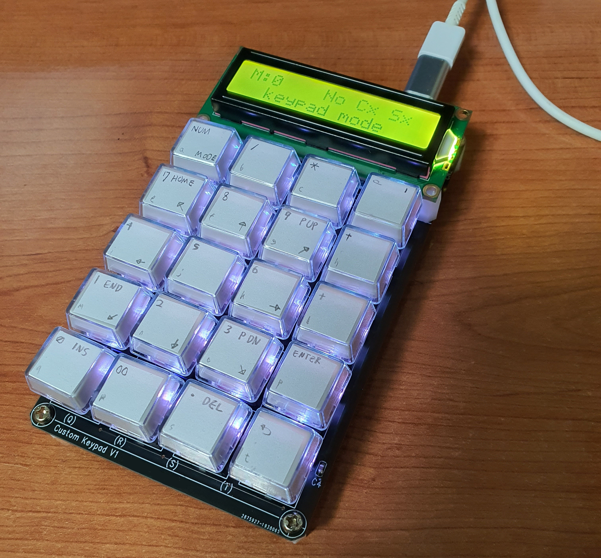
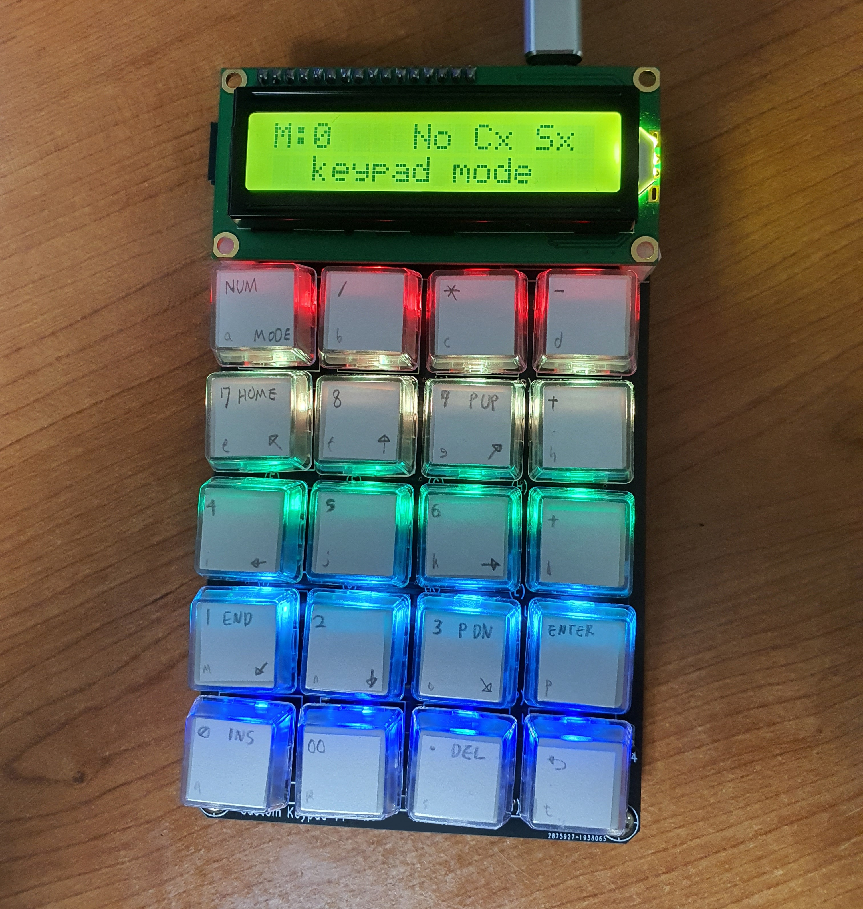

# CKP_v1

## 📌 Description
**CKP (Custom KeyPad)** is a standalone USB keypad built with a 5×4 matrix and a character LCD.  
Runs entirely on an ATmega32U4, with full USB HID support and no external modules.

  
  

---

## 🔧 Hardware

- **MCU**: ATmega32U4 (e.g. Pro Micro)  
- **Key Matrix**: 4 rows × 5 columns  
- **Display**: 16x2 character LCD (4-bit mode)

---

## 💻 Development Environment

- **IDE**: Arduino IDE  
- **Board**: Arduino Pro Micro (5V, 16MHz)  
- **Libraries**:
  - [NicoHood/HID](https://github.com/NicoHood/HID)
  - `LiquidCrystal` (Arduino built-in)

---

## 🔌 USB

- Recognized as a standard HID keyboard by host  
- Sends keycodes based on internal mapping
